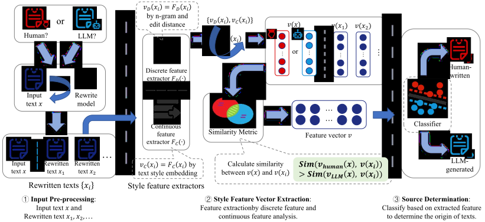

# StyleDecipher: Robust and Explainable Detection of LLM-Generated Texts with Stylistic Analysis

StyleDecipher is a stylistic analysis-based method for detecting LLM-generated text. The method constructs a unified representation space that combines discrete stylistic indicators with continuous stylistic representations to capture stylistic differences between human and machine-generated text. 


Compared to traditional approaches, StyleDecipher offers domain-agnostic detection, robustness against adversarial perturbations, and strong explainability.

Here is a framework pipeline of StyleDecipher.



*The pipeline jointly models discrete and continuous stylistic representations for robust text authenticity detection.* 

More details can be found in our paper: [StyleDecipher: Robust and Explainable Detection of LLM-Generated Texts with Stylistic Analysis](https://arxiv.org/abs/2510.12608)

## Installation

### Prerequisites

- Python 3.9 or higher
- CUDA-compatible GPU (recommended for optimal performance)


### Setup

1. Clone the repository:
```bash
git clone https://github.com/SiyuanLi00/StyleDecipher.git
cd StyleDecipher
```

2. Create a virtual environment:
```bash
conda create -n style_decipher python=3.9
conda activate style_decipher
```

3. Install dependencies:
```bash
pip install -r requirements.txt
```

## Dataset

StyleDecipher supports evaluation across multiple domains and scenarios. The framework expects datasets in JSON format with the following structure:

### Data Format
```json
[
    {
        "Index": 1,
        "Text": "Your text content here...",
        "Source": "human (or GPT for machine-generated)"
    }
]
```

### Supported Domains
The following are human-written datasets, with corresponding LLM-generated texts created using GPT-3.5-turbo. StyleDecipher has been evaluated on the following domains:

- **[News](https://huggingface.co/datasets/acmc/ghostbuster_reuter)**: Human-written texts from Reuters_50_50 dataset (2006)
- **[Student Essays](https://huggingface.co/datasets/qwedsacf/ivypanda-essays)**: Academic writing samples from IvyPanda repository
- **[HumanEval Code](https://huggingface.co/datasets/openai/openai_humaneval)**: Programming code snippets from HumanEval dataset
- **[Yelp Reviews](https://huggingface.co/datasets/Yelp/yelp_review_full)**: Restaurant and business reviews from Yelp
- **[Paper Abstracts](https://huggingface.co/datasets/QiXuanLo/DBLPDataset)**: 500 abstracts sampled from ACL 2023 papers

Additionally, we apply the latest benchmark RAID to test our method:

- **[RAID Dataset](https://github.com/liamdugan/raid)**: RAID is the largest & most comprehensive dataset for evaluating AI-generated text detectors. It contains over 10 million documents spanning 11 LLMs, 11 genres, 4 decoding strategies, and 12 adversarial attacks.


## Quick Start

### Basic Usage
Here we will show you how to use StyleDecipher to extract style features from a dataset. This is also the In-Domain Experiment in the paper.

**Run style extraction and analysis**:
Set up your config in `main.py` and run `main.py` to extract style features, including openai api key, base url, model name, and file path configuration.
```python
class Config:
    """Configuration management class"""
    def __init__(self):
        # OpenAI configuration
        self.openai_api_key = 'YOUR_API_KEY'
        self.openai_base_url = "YOUR_URL"

        self.openai_model = "REWRITE_MODEL"
        self.max_completion_tokens = 512
        
        # File path configuration
        self.domain_path = "your/dataset/path.json"
        self.rewrite_data_path = "your/rewrite_data_path.json"
        self.feature_vectors_path = "your/feature_vectors_path.json"

```
```bash
python main.py
```

After building the feature vectors, you can also run 'experiment_main.py' to perform classification.

```bash
python experiment_main.py
```

## Experiment

Here we will discuss how to run other experiments mentioned in the paper.

### Out-of-Domain Experiment
To run the Out-of-Domain Experiment, you need to prepare enough domain datasets to cover all the domains you want to evaluate. And run style extraction and analysis by `main.py` with different dataset path setting.

After that, setting your style extraction results in `experiment_OOD.py` and run it to evaluate the StyleDecipher on out-of-domain datasets.
```bash
python experiment_OOD.py
```

### Robustness Experiment
You can use python scripts in `robust_dataset_building/` to build robustness datasets. And evaluate them by `main.py` with same approach as In-Domain Experiment.

### Pluggable Performance
To evaluate the pluggable performance of StyleDecipher, you can run `experiment_plugin.py` to extract features using different text embedding method after getting rewritten data and feature vectors in `main.py`. 

### Explainability Evaluation and Visualization
To evaluate the explainability of StyleDecipher, you can run scripts in `plot/` to visualize data distribution and get explanation metric results.


## Citation
If you use this code as part of your research, please cite:

Siyuan Li, Aodu Wulianghai, Xi Lin, Guangyan Li, Xiang Chen, Jun Wu, Jianhua Li. ["StyleDecipher: Robust and Explainable Detection of LLM-Generated Texts with Stylistic Analysis."](https://arxiv.org/abs/2510.12608) arXiv preprint arXiv:2510.12608 (2025).

```bibtex
@article{li2025styledecipher,
  title={StyleDecipher: Robust and Explainable Detection of LLM-Generated Texts with Stylistic Analysis},
  author={Li, Siyuan and Wulianghai, Aodu and Lin, Xi and Li, Guangyan and Chen, Xiang and Wu, Jun and Li, Jianhua},
  journal={arXiv preprint arXiv:2510.12608},
  year={2025}
}
```